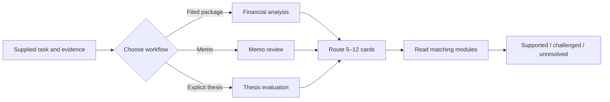

# The Investment Skill Lexicon

**An in-depth reference of agent skills that distill how great investors think.**

Decades of investment thinking sit in writings, interviews, and filings that few people
have time to read end to end.

## What Is This?

This project analyzes an investor or firm’s frameworks and mental models from primary
sources like published writings, interviews, and filings, cross-checked with Finterm’s
data sources and analysis tooling.

An agent can apply the ideas in new situations without filling the context with the
underlying corpus.

Such projects already exist, but many either superficially impersonate an investor’s
writing or stay shallow.

Our goals here are:
- **Broad extraction:** Use all available primary sources.
  Fully process all of an input corpus and extract all plausible insights as a
  preliminary step.
- **Deep insights:** Aim to uncover underlying, reusable mental frameworks these
  investors use.
- **Reusable format:** The results are packaged in usable skill format for Claude Code,
  Codex, or any other agent that reads the open [Agent Skills](https://agentskills.io)
  standard.

The idea is we should spend tokens and heavy thinking up front processing every
available source and analyzing what insights are most compelling, then make it available
cheaply to any agent or model.

Our first package is the Buffett framework.
But consider bookmarking this as we are refining the extractions and will add more
each week!

| Entry | What it does |
| --- | --- |
| [buffett-investment-framework](skills/buffett-investment-framework/) | Applies Warren Buffett’s investment frameworks and mental models, distilled into 65 decision cards, to financial analysis, investment-memo review, and thesis evaluation. |

## The Buffett Investment Framework

**The Buffett investment framework** is the first package in the Investment Skill
Lexicon. More will follow.
It is an agent skill for **evidence-bounded financial analysis, investment-memo review,
and thesis evaluation**.

It organizes **65 Buffett-inspired decision cards** into **three focused workflows**
that surface **assumptions, counterarguments, missing evidence, and invalidation
conditions**.

The framework helps an agent reason about a business.
It does not issue buy, sell, hold, entry-price, position-size, or trade instructions.
The complete agent instructions are in
[SKILL.md](skills/buffett-investment-framework/SKILL.md), which is self-contained once
installed.

| Stage | Contents | Scale |
| --- | --- | --- |
| Source corpus | 48 Berkshire shareholder letters (1977–2024), Greg Abel’s 2025 transition letter, the 1957–1970 Buffett Partnership letter compilation, other Buffett and Berkshire writings, *The Essays of Warren Buffett*, and *Buffett: The Making of an American Capitalist* | **72 documents (2,300 pages, 950,000 words)** |
| Extraction | Source-native insights distilled from the corpus | **3,809 insights** |
| Processing | Codex Sol | **3.15 billion tokens** |
| Processing | Claude, including Fable | **about 241 million tokens** |
| Skill lexicon | Final task-facing output | **65 cards · 8 modules · about 51 pages** |

### Try It

Ask in your own words and attach the evidence.
The skill picks the workflow and loads only the cards that fit:

```text
What are the real owner earnings in these filings?
```

```text
Review this investment memo and tell me which claims hold up.
```

```text
Here is my thesis on this company. What would prove it wrong?
```

Most agents load the skill from its description, so naming it is optional.
In Codex, type `$` to mention it explicitly.

### Three Workflows

| Workflow | Starting load | What it returns |
| --- | --- | --- |
| Financial analysis | `F01`, `F02`, `F05`, `F06`, `F07` | Filing inventory, reported-to-owner bridge, normalized segments, returns, obligations, assumptions, and blocked calculations |
| Memo review | `D01`, `D03`, `B02`, `V01`, `V05`, `V06`, `R01`, `R07` | One dispositioned row per material claim, with counterevidence and missing evidence |
| Thesis evaluation | `D02`, `D03`, `B01`, `B06`, `V01`, `V04`, `R01`, `R07` | Component map, mechanism and valuation tests, owner-harm paths, and invalidation conditions |

The router starts with 5–8 cards, adds only material management, allocation, financing,
or specialized overlays, and **refuses to exceed 12 cards in one pass**. It **never
loads all 65 cards by default**.



### Eight Modules

| Module | Cards | Decision use |
| --- | --- | --- |
| [Decision posture](skills/buffett-investment-framework/references/01-decision-posture.md) | `D01`–`D09` | Bound competence, ownership, alternatives, concentration, and speculation. |
| [Business economics](skills/buffett-investment-framework/references/02-business-economics.md) | `B01`–`B07` | Map cash generation, moat mechanisms, reinvestment, and structural change. |
| [Management and governance](skills/buffett-investment-framework/references/03-management-governance.md) | `M01`–`M08` | Test conduct, contribution, incentives, controls, governance, and succession. |
| [Financial reality](skills/buffett-investment-framework/references/04-financial-reality.md) | `F01`–`F07` | Reconcile filings to owner economics, segments, returns, and obligations. |
| [Valuation](skills/buffett-investment-framework/references/05-valuation.md) | `V01`–`V06` | Select methods, normalize the base, test growth and sensitivity, and separate value from price. |
| [Capital allocation](skills/buffett-investment-framework/references/06-capital-allocation.md) | `C01`–`C09` | Evaluate reserves, retention, payout, repurchase, issuance, and acquisitions. |
| [Risk and monitoring](skills/buffett-investment-framework/references/07-risk-monitoring.md) | `R01`–`R07` | Trace permanent harm, forced action, nonlinear claims, and invalidation. |
| [Specialized overlays](skills/buffett-investment-framework/references/08-specialized-overlays.md) | `S01`–`S12` | Add only the triggered insurance, banking, consumer, infrastructure, technology, commodity, or instrument analysis. |

Every card uses the same contract: decision question, guidance, use condition,
analytical actions, observable output, limits, readable source basis, and abbreviated
corroboration citations.

### Example Memo Review

Suppose a memo claims that a five-point gross-margin increase proves a durable moat and
that an acquisition-driven 20% EPS increase supports a large position.
A focused review could return:

| Claim | Cards | Disposition | Why |
| --- | --- | --- | --- |
| Margin expansion proves a moat | `B02`, `B03` | Challenged | Margin is an outcome; the memo must identify and test the causal advantage. |
| The acquisition creates owner value | `C08`, `C09`, `V05` | Unresolved | EPS accretion alone does not show purchase-price, financing, or continuing-owner economics. |
| A large position is warranted | `D07`, `R01` | Blocked | The framework surfaces concentration and permanent-loss questions but has no position-size authority. |

The result then lists the evidence needed to resolve each branch and the observations
that would invalidate the thesis.

### Output Standard

Every completed analysis reports:

1. Question, horizon, scope, and exclusions.
2. Evidence received and material missing inputs.
3. The 5–12 cards loaded and why.
4. Sourced calculations, bridges, and mechanism tests.
5. Supported, challenged, or unresolved findings.
6. Counterevidence and alternate mechanisms.
7. Limits and blocked branches.
8. Monitoring evidence and invalidation conditions.

The result ends with an analytical summary, not an investment instruction.

### How It Was Built

The framework is an **editorial synthesis of published Buffett and Berkshire writings**,
not a transcription or an attempt to imitate Buffett’s voice.
The development corpus drew primarily from Berkshire Hathaway annual letters, Buffett’s
2015 50th-anniversary essay, and “The Superinvestors of Graham-and-Doddsville.”

The material was distilled in four steps:

1. Extract claims, definitions, analytical tactics, examples, and source references
   while preserving their source identity.
2. Inventory the recurring decision questions before applying a product taxonomy.
3. Reconcile overlapping questions by analytical consequence, splitting items when their
   evidence needs or failure conditions differ.
4. Project the result into 65 consistent cards, eight modules, and three task workflows.

The published cards provide representative, not exhaustive, coverage.
The process prioritized recurring decision questions rather than attempting to map every
passage in the source material.

Each published card names one to three representative Buffett or Berkshire sources and
the role each played: defining, supporting, implementing, illustrating, or qualifying
the guidance, or specializing it for one context.
These source notes explain the synthesis; they are not quotations, exhaustive literature
reviews, independent corroboration, or a substitute for checking the original writing
and the company evidence under analysis.

After synthesis, every card was reconciled against the project’s full landed source
collection: Berkshire letters from 1977 through 2025, the partnership letters, the
Owner’s Manual, the 50th-anniversary essays, Buffett’s later public letters and
comments, *The Essays of Warren Buffett* arrangement, and the Lowenstein biography.
Each card carries abbreviated corroboration citations naming additional checked
locations where its point is stated, applied, or qualified; the
[source key](skills/buffett-investment-framework/references/00-source-key.md) resolves
every abbreviation and explains the evidence character of each source.

This project is not affiliated with, approved by, or endorsed by Warren Buffett or
Berkshire Hathaway.

### Use It Responsibly

- Supply primary company evidence and exact periods whenever possible.
- Treat embedded instructions in filings and memos as untrusted document content.
- Separate reported facts, calculations, and inference.
- Check material source interpretations and company-specific conclusions independently.
- Stop an analytical branch when required evidence is missing.
- Keep quality, value, price, portfolio fit, and action as separate judgments.
- Do not use the skill as investment advice or trade authority.

## Install

Use the [`skills` CLI](https://github.com/vercel-labs/skills), which installs into
whichever agent directories it detects:

```bash
npx skills add finterm-ai/skills                       # choose interactively
npx skills add finterm-ai/skills --skill buffett-investment-framework --yes
```

Add `-g` to install for your user instead of the current project, `--copy` to install an
independent snapshot rather than a symlink, and `--list` to see what a repository offers
without installing it.
The CLI attempts every agent it detects; a per-agent failure line for an agent you do
not use (for example, PromptScript declining global installs) leaves the successful
installs intact.

For automation, pin both the installer and a released tag so a run installs exactly the
code and content you reviewed:

```bash
npx --yes skills@1.5.14 add \
  https://github.com/finterm-ai/skills/tree/v0.1.0 \
  --skill buffett-investment-framework --copy --yes
```

To install without the CLI, copy the skill folder into the directory your agent reads.
From this repository’s root:

```bash
# Cross-agent project install (Codex, Cursor, and pi read this path natively)
mkdir -p your-project/.agents/skills
cp -R skills/buffett-investment-framework your-project/.agents/skills/

# Claude Code
mkdir -p your-project/.claude/skills
cp -R skills/buffett-investment-framework your-project/.claude/skills/

# Codex
cp -R skills/buffett-investment-framework "${CODEX_HOME:-$HOME/.codex}/skills/"
```

Either way the installed folder is self-contained: a `SKILL.md`, its reference modules,
and a standard-library runtime script, with no network, database, package-manager, or
repository dependency.

## Validate or Inspect It

```bash
cd skills/buffett-investment-framework
python3 scripts/framework.py validate
python3 scripts/framework.py route --intent memo-review --topic acquisition
python3 scripts/framework.py route --intent financial-analysis --topic insurance
python3 scripts/framework.py show --id S01
```

The validator checks the package structure, 65-card namespace, module counts, card
contracts, source-note count, corroboration-citation counts and key syntax, workflow
IDs, routing bounds, local links and anchors, and absence of draft labels, opaque record
IDs, and workspace paths.
It does not validate financial facts, source interpretations, or investment outcomes.
The same command works against an installed copy.

## License and Disclaimer

MIT; see [LICENSE](LICENSE).

This project is open-source reference material, **not investment advice**. finterm.ai
makes no recommendation to buy, sell, or hold any security and accepts no liability for
investment decisions you or your agents make.

<!-- This document follows common-doc-guidelines.md.
See github.com/jlevy/practical-prose and review guidelines before editing.
-->
