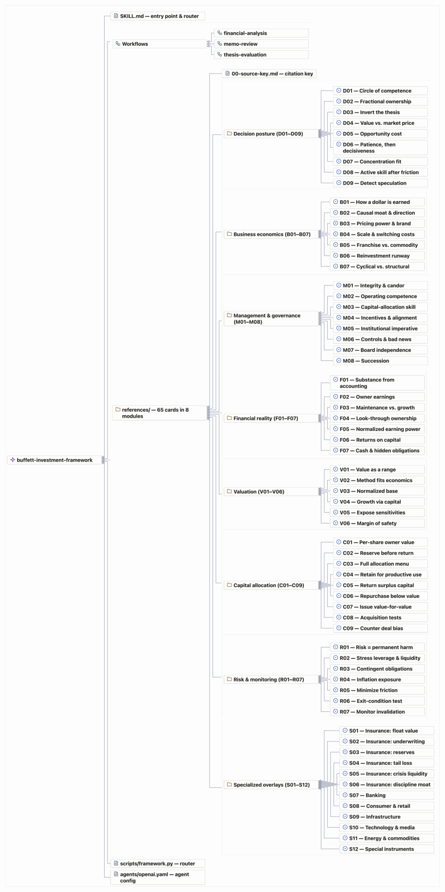

# The Investment Skill Lexicon

**An in-depth reference of agent skills that distill how great investors think.**

## Why?

Decades of investment thinking sit in writings, interviews, and filings that few people
have time to read end to end.

This project analyzes an investor or firm’s frameworks and mental models from primary
sources like published writings, interviews, and filings, cross-checked with Finterm’s
data sources and analysis tooling.

An agent can apply the ideas in new situations without filling the context with the
underlying corpus.

## How Are These Skills Different?

A simple prompt or skill can lead a model to emulate style superficially.
But our goal is not to imitate the style of an investor.

We want to give thorough, accurate context so agents apply mental frameworks rigorously.
Our goals are:

- **Broad extraction:** Use all available primary sources.
  Fully process all of an input corpus and extract all plausible insights as a
  preliminary step.
- **Deep insights:** Analyze materials to uncover underlying, non-obvious mental
  frameworks talented investors use.
- **Reusable format:** The results are packaged in usable skill format for Claude Code,
  Codex, or any other agent that reads the open [Agent Skills](https://agentskills.io)
  standard.

The idea is we should spend tokens and heavy thinking up front processing every
available source and analyzing what insights are most compelling, then make it available
cheaply to any agent or model.

## The Buffett Investment Framework

**The Buffett investment framework** distills 950,000 words of primary Buffett and
Berkshire writing into **65 evidence-bounded decision cards** an agent can use.

It is an agent skill for **evidence-bounded financial analysis, investment-memo review,
and thesis evaluation**. It offers **three focused workflows** that surface
**assumptions, counterarguments, missing evidence, and invalidation conditions**. Cards
are loaded 5–12 at a time to keep context use efficient.

The framework helps an agent reason about a business.
It does not issue buy, sell, hold, entry-price, position-size, or trade instructions.
The complete agent instructions are in
[SKILL.md](skills/buffett-investment-framework/SKILL.md), which is self-contained once
installed.

| Stage | Contents | Scale |
| --- | --- | --- |
| Source corpus | 48 Berkshire shareholder letters (1977–2024), Greg Abel’s 2025 transition letter, the 1957–1970 Buffett Partnership letter compilation, other Buffett and Berkshire writings, *The Essays of Warren Buffett*, and *Buffett: The Making of an American Capitalist* | **72 documents (2,300 pages, 950,000 words)** |
| Extraction | Source-native insights distilled from the corpus | **3,809 insights** |
| Processing | Extraction and synthesis ran across Codex Sol and Claude Fable | **about 3.4 billion tokens** |
| Skill lexicon | Final task-facing output | **65 cards · 8 modules · about 51 pages** |

## A Growing Collection of Skills

We see this “lexicon” as a growing collection.
The first piece is the Buffett framework.
Consider bookmarking this as we are refining the extractions and will add more each
week!

| Investor | Status | Primary sources | Framework focus |
| --- | --- | --- | --- |
| Warren Buffett | ✅ Complete | 48 Berkshire shareholder letters (1977–2024), the 1957–1970 partnership letters, *The Essays of Warren Buffett*, and *Buffett: The Making of an American Capitalist* | [buffett-investment-framework](skills/buffett-investment-framework/) applies Buffett’s investment frameworks and mental models, distilled into 65 decision cards, to financial analysis, investment-memo review, and thesis evaluation |
| Charlie Munger | Queued | *Poor Charlie’s Almanack* (the Stripe Press edition is free online), Wesco Financial and Daily Journal meeting transcripts, “The Psychology of Human Misjudgment” | Mental models, inversion, and the psychology of misjudgment |
| Benjamin Graham | Queued | *Security Analysis*, *The Intelligent Investor*, Graham-Newman letters, 1955 congressional testimony, late lectures | Margin of safety, Mr. Market, and quantitative value screens |
| Howard Marks | Queued | About 160 Oaktree client memos (1990–present, public archive), *The Most Important Thing*, *Mastering the Market Cycle* | Risk versus loss, market cycles, and second-level thinking |
| Philip Fisher | Queued | *Common Stocks and Uncommon Profits*, *Conservative Investors Sleep Well*, *Developing an Investment Philosophy* | Scuttlebutt research and the fifteen-point growth checklist |
| Peter Lynch | Queued | *One Up on Wall Street*, *Beating the Street*, Worth magazine columns | Stock categories, growth at a reasonable price, and the everyday-knowledge edge |
| Nick Sleep and Qais Zakaria | Queued | The Nomad Investment Partnership letters, 2001–2014, released free by the authors | Scale economies shared, destination analysis, and the cost of growth |
| Jeremy Grantham | Queued | GMO quarterly letters and Viewpoints (public archive) | Bubbles, mean reversion, and asset-class regimes |
| Joel Greenblatt | Queued | *You Can Be a Stock Market Genius*, *The Little Book That Beats the Market*, Columbia special-situations lectures | Spinoffs, special situations, and where structural mispricing hides |
| Stanley Druckenmiller | Queued | Three decades of long-form talks and interviews, including the transcribed 2015 Lost Tree Club speech | Concentrated macro positioning, asymmetric bet sizing, and liquidity-regime reading |

## Try It

Install with the [`skills` CLI](https://github.com/vercel-labs/skills) (more options
under [Other Install Methods](#other-install-methods)):

```bash
npx skills add finterm-ai/investment-skills --skill buffett-investment-framework --yes
```

Then ask in your own words and attach the evidence.
The skill picks the workflow and loads only the cards that fit:

```text
What are the real owner earnings in these filings?
```

```text
Review this investment memo and tell me which claims hold up.
```

```text
Here is my thesis on this company. What would prove it wrong?
```

Most agents load the skill from its description, so naming it is optional.
In Codex, type `$` to mention it explicitly.

## How It Works

### Three Workflows

| Workflow | Starting load | What it returns |
| --- | --- | --- |
| Financial analysis | `F01`, `F02`, `F05`, `F06`, `F07` | Filing inventory, reported-to-owner bridge, normalized segments, returns, obligations, assumptions, and blocked calculations |
| Memo review | `D01`, `D03`, `B02`, `V01`, `V05`, `V06`, `R01`, `R07` | One dispositioned row per material claim, with counterevidence and missing evidence |
| Thesis evaluation | `D02`, `D03`, `B01`, `B06`, `V01`, `V04`, `R01`, `R07` | Component map, mechanism and valuation tests, owner-harm paths, and invalidation conditions |

The router starts with 5–8 cards, adds only material management, allocation, financing,
or specialized overlays.
It caps at 12 cards in one pass to preserve context and stay focused.



### Eight Modules

| Module | Cards | Decision use |
| --- | --- | --- |
| [Decision posture](skills/buffett-investment-framework/references/01-decision-posture.md) | `D01`–`D09` | Bound competence, ownership, alternatives, concentration, and speculation. |
| [Business economics](skills/buffett-investment-framework/references/02-business-economics.md) | `B01`–`B07` | Map cash generation, moat mechanisms, reinvestment, and structural change. |
| [Management and governance](skills/buffett-investment-framework/references/03-management-governance.md) | `M01`–`M08` | Test conduct, contribution, incentives, controls, governance, and succession. |
| [Financial reality](skills/buffett-investment-framework/references/04-financial-reality.md) | `F01`–`F07` | Reconcile filings to owner economics, segments, returns, and obligations. |
| [Valuation](skills/buffett-investment-framework/references/05-valuation.md) | `V01`–`V06` | Select methods, normalize the base, test growth and sensitivity, and separate value from price. |
| [Capital allocation](skills/buffett-investment-framework/references/06-capital-allocation.md) | `C01`–`C09` | Evaluate reserves, retention, payout, repurchase, issuance, and acquisitions. |
| [Risk and monitoring](skills/buffett-investment-framework/references/07-risk-monitoring.md) | `R01`–`R07` | Trace permanent harm, forced action, nonlinear claims, and invalidation. |
| [Specialized overlays](skills/buffett-investment-framework/references/08-specialized-overlays.md) | `S01`–`S12` | Add only the triggered insurance, banking, consumer, infrastructure, technology, commodity, or instrument analysis. |

Every card uses the same contract: decision question, guidance, use condition,
analytical actions, observable output, limits, readable source basis, and abbreviated
corroboration citations.

### Output Standard

Every completed analysis reports:

1. Question, horizon, scope, and exclusions.
2. Evidence received and material missing inputs.
3. The 5–12 cards loaded and why.
4. Sourced calculations, bridges, and mechanism tests.
5. Supported, challenged, or unresolved findings.
6. Counterevidence and alternate mechanisms.
7. Limits and blocked branches.
8. Monitoring evidence and invalidation conditions.

The result ends with an analytical summary.

## Design Notes

### How It Was Built

The framework is an **editorial synthesis of published Buffett and Berkshire writings**,
not a transcription or an attempt to imitate Buffett’s voice.
The development corpus drew primarily from Berkshire Hathaway annual letters, Buffett’s
2015 50th-anniversary essay, and “The Superinvestors of Graham-and-Doddsville.”

The material was distilled in four steps:

1. Extract claims, definitions, analytical tactics, examples, and source references
   while preserving their source identity.
2. Inventory the recurring decision questions before applying a product taxonomy.
3. Reconcile overlapping questions by analytical consequence, splitting items when their
   evidence needs or failure conditions differ.
4. Project the result into 65 consistent cards, eight modules, and three task workflows.

```mermaid
flowchart LR
    corpus["<b>Source corpus</b><br/>primary writings, letters,<br/>interviews, filings"]
    extract["<b>1 · Extract</b><br/>source-native insights,<br/>identity preserved"]
    inventory["<b>2 · Inventory</b><br/>recurring decision questions,<br/>before any taxonomy"]
    reconcile["<b>3 · Reconcile</b><br/>overlapping questions merged<br/>or split by consequence"]
    project["<b>4 · Project</b><br/>consistent cards, modules,<br/>and task workflows"]
    corroborate["<b>Corroborate</b><br/>every card re-checked against<br/>the full landed collection"]
    validate["<b>Validate</b><br/>one command: contracts,<br/>sources, routing, links"]
    use["<b>Agent use</b><br/>router loads a small card<br/>set per task, never all"]

    corpus --> extract --> inventory --> reconcile --> project
    project --> corroborate --> validate --> use

    classDef src fill:#f5f0e1,stroke:#b8a878,color:#1f2328;
    classDef step fill:#e9f2fc,stroke:#7ba7d7,color:#1f2328;
    classDef check fill:#e3f3ee,stroke:#6fb39c,color:#1f2328;
    classDef out fill:#f1ecfa,stroke:#a68fd8,color:#1f2328;
    class corpus src
    class extract,inventory,reconcile,project step
    class corroborate,validate check
    class use out
```



The published cards provide representative, not exhaustive, coverage.
The process prioritized recurring decision questions rather than attempting to map every
passage in the source material.

Each published card names one to three representative Buffett or Berkshire sources and
the role each played: defining, supporting, implementing, illustrating, or qualifying
the guidance, or specializing it for one context.
These source notes explain the synthesis; they are not quotations, exhaustive literature
reviews, independent corroboration, or a substitute for checking the original writing
and the company evidence under analysis.

After synthesis, every card was reconciled against the project’s full landed source
collection: Berkshire letters from 1977 through 2024, the 2025 transition and farewell
letters, the partnership letters, the Owner’s Manual, the 50th-anniversary essays,
Buffett’s later public letters and comments, *The Essays of Warren Buffett* arrangement,
and the Lowenstein biography.
Each card carries abbreviated corroboration citations naming additional checked
locations where its point is stated, applied, or qualified; the
[source key](skills/buffett-investment-framework/references/00-source-key.md) resolves
every abbreviation and explains the evidence character of each source.

This project is not affiliated with, approved by, or endorsed by Warren Buffett or
Berkshire Hathaway.

### Design Choices

- **Deterministic routing.** `scripts/framework.py` is a standard-library Python script;
  no model chooses the card load.
  The same intent and topics always produce the same cards.
- **A hard card cap.** 5–12 cards per pass: agent context is treated as a budget.
- **A one-command validator.** `validate` checks the 65-card namespace and per-card
  field contracts.
- **A structural authority boundary.** Cards return supported, challenged, or unresolved
  findings.

## Other Install Methods

Use the [`skills` CLI](https://github.com/vercel-labs/skills), which installs into
whichever agent directories it detects:

```bash
npx skills add finterm-ai/investment-skills --skill buffett-investment-framework --yes
```

Add `-g` to install for your user instead of the current project, `--copy` to install an
independent snapshot rather than a symlink, and `--list` to see what a repository offers
without installing it.
The CLI attempts every agent it detects; a per-agent failure line for an agent you do
not use (for example, PromptScript declining global installs) leaves the successful
installs intact.

To install without the CLI, copy the skill folder into the directory your agent reads.
From this repository’s root:

```bash
# Cross-agent project install (Codex, Cursor, and pi read this path natively)
mkdir -p your-project/.agents/skills
cp -R skills/buffett-investment-framework your-project/.agents/skills/

# Claude Code
mkdir -p your-project/.claude/skills
cp -R skills/buffett-investment-framework your-project/.claude/skills/

# Codex
cp -R skills/buffett-investment-framework "${CODEX_HOME:-$HOME/.codex}/skills/"
```

## Development

Development docs live in [development.md](development.md) and
[viz/README.md](viz/README.md).

## License and Disclaimer

MIT. See [LICENSE](LICENSE).

This project is open-source reference material, **not investment advice**. finterm.ai
makes no recommendation to buy, sell, or hold any security and accepts no liability for
investment decisions you or your agents make.

<!-- This document follows common-doc-guidelines.md.
See github.com/jlevy/practical-prose and review guidelines before editing.
-->
