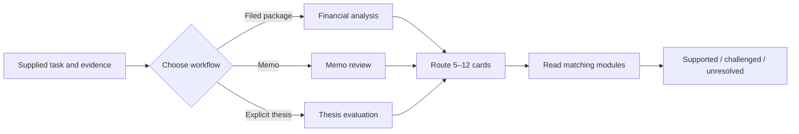

# Buffett Investment Framework

An agent skill for evidence-bounded financial analysis, investment-memo review, and
thesis evaluation.
It organizes 65 Buffett-inspired decision cards into focused workflows
that surface assumptions, counterarguments, missing evidence, and invalidation
conditions.

The framework helps an agent reason about a business.
It does not issue buy, sell, hold, entry-price, position-size, or trade instructions.
Read the complete [agent instructions](../buffett-investment-framework/SKILL.md) or start
with one of the prompts below.

## Try It

```text
Use $buffett-investment-framework to analyze these filings. Reconcile reported earnings
to owner earnings, test capital efficiency and obligations, and identify every blocked
calculation.
```

```text
Use $buffett-investment-framework to review this investment memo claim by claim. Separate
facts, calculations, and inference; test the moat and valuation mechanisms; and return
supported, challenged, or unresolved findings.
```

```text
Use $buffett-investment-framework to evaluate this thesis. Preserve its meaning, build
the strongest contrary account, test value separately from price, and state what would
invalidate each component.
```

## Install the Skill

Copy the self-contained skill folder into the skill directory used by your agent; the
[repository README](../README.md#install) lists the copy commands for each agent.

The installed package contains everything required at runtime:

```text
buffett-investment-framework/
├── SKILL.md
├── agents/
│   └── openai.yaml
├── references/
│   ├── 00-source-key.md
│   ├── 01-decision-posture.md
│   ├── 02-business-economics.md
│   ├── 03-management-governance.md
│   ├── 04-financial-reality.md
│   ├── 05-valuation.md
│   ├── 06-capital-allocation.md
│   ├── 07-risk-monitoring.md
│   └── 08-specialized-overlays.md
└── scripts/
    └── framework.py
```

The runtime script uses only the Python standard library.
The skill has no network, database, package-manager, or repository dependency.

## How It Was Built

The framework is an editorial synthesis of published Buffett and Berkshire writings, not
a transcription or an attempt to imitate Buffett’s voice.
The development corpus drew primarily from Berkshire Hathaway annual letters, Buffett’s
2015 50th-anniversary essay, and “The Superinvestors of Graham-and-Doddsville.”

The material was distilled in four steps:

1. Extract claims, definitions, analytical tactics, examples, and source references
   while preserving their source identity.
2. Inventory the recurring decision questions before applying a product taxonomy.
3. Reconcile overlapping questions by analytical consequence, splitting items when their
   evidence needs or failure conditions differ.
4. Project the result into 65 consistent cards, eight modules, and three task workflows.

The published cards provide representative, not exhaustive, coverage.
The process prioritized recurring decision questions rather than attempting to map every
passage in the source material.

Each published card names one to three representative Buffett or Berkshire sources and
the role each played: defining, supporting, implementing, illustrating, or qualifying
the guidance, or specializing it for one context.
These source notes explain the synthesis; they are not quotations, exhaustive literature
reviews, independent corroboration, or a substitute for checking the original writing
and the company evidence under analysis.

After synthesis, every card was reconciled against the project’s full landed source
collection — Berkshire letters from 1977 through 2025, the partnership letters, the
Owner’s Manual, the 50th-anniversary essays, Buffett’s later public letters and
comments, *The Essays of Warren Buffett* arrangement, and the Lowenstein biography.
Each card carries abbreviated corroboration citations naming additional checked
locations where its point is stated, applied, or qualified; the
[source key](../buffett-investment-framework/references/00-source-key.md) resolves every
abbreviation and explains the evidence character of each source.

This project is not affiliated with, approved by, or endorsed by Warren Buffett or
Berkshire Hathaway.

## Three Workflows

| Workflow | Starting load | What it returns |
| --- | --- | --- |
| Financial analysis | `F01`, `F02`, `F05`, `F06`, `F07` | Filing inventory, reported-to-owner bridge, normalized segments, returns, obligations, assumptions, and blocked calculations |
| Memo review | `D01`, `D03`, `B02`, `V01`, `V05`, `V06`, `R01`, `R07` | One dispositioned row per material claim, with counterevidence and missing evidence |
| Thesis evaluation | `D02`, `D03`, `B01`, `B06`, `V01`, `V04`, `R01`, `R07` | Component map, mechanism and valuation tests, owner-harm paths, and invalidation conditions |

The router starts with five to eight cards, adds only material management, allocation,
financing, or specialized overlays, and refuses to exceed 12 cards in one pass.
It never loads all 65 cards by default.



## Example Memo Review

Suppose a memo claims that a five-point gross-margin increase proves a durable moat and
that an acquisition-driven 20% EPS increase supports a large position.
A focused review could return:

| Claim | Cards | Disposition | Why |
| --- | --- | --- | --- |
| Margin expansion proves a moat | `B02`, `B03` | Challenged | Margin is an outcome; the memo must identify and test the causal advantage. |
| The acquisition creates owner value | `C08`, `C09`, `V05` | Unresolved | EPS accretion alone does not show purchase-price, financing, or continuing-owner economics. |
| A large position is warranted | `D07`, `R01` | Blocked | The framework surfaces concentration and permanent-loss questions but has no position-size authority. |

The result then lists the evidence needed to resolve each branch and the observations
that would invalidate the thesis.

## Eight Modules

| Module | Cards | Decision use |
| --- | --- | --- |
| [Decision posture](../buffett-investment-framework/references/01-decision-posture.md) | `D01`–`D09` | Bound competence, ownership, alternatives, concentration, and speculation. |
| [Business economics](../buffett-investment-framework/references/02-business-economics.md) | `B01`–`B07` | Map cash generation, moat mechanisms, reinvestment, and structural change. |
| [Management and governance](../buffett-investment-framework/references/03-management-governance.md) | `M01`–`M08` | Test conduct, contribution, incentives, controls, governance, and succession. |
| [Financial reality](../buffett-investment-framework/references/04-financial-reality.md) | `F01`–`F07` | Reconcile filings to owner economics, segments, returns, and obligations. |
| [Valuation](../buffett-investment-framework/references/05-valuation.md) | `V01`–`V06` | Select methods, normalize the base, test growth and sensitivity, and separate value from price. |
| [Capital allocation](../buffett-investment-framework/references/06-capital-allocation.md) | `C01`–`C09` | Evaluate reserves, retention, payout, repurchase, issuance, and acquisitions. |
| [Risk and monitoring](../buffett-investment-framework/references/07-risk-monitoring.md) | `R01`–`R07` | Trace permanent harm, forced action, nonlinear claims, and invalidation. |
| [Specialized overlays](../buffett-investment-framework/references/08-specialized-overlays.md) | `S01`–`S12` | Add only the triggered insurance, banking, consumer, infrastructure, technology, commodity, or instrument analysis. |

Every card uses the same contract: decision question, guidance, use condition,
analytical actions, observable output, limits, readable source basis, and abbreviated
corroboration citations.

## Output Standard

Every completed analysis reports:

1. Question, horizon, scope, and exclusions.
2. Evidence received and material missing inputs.
3. The five to 12 cards loaded and why.
4. Sourced calculations, bridges, and mechanism tests.
5. Supported, challenged, or unresolved findings.
6. Counterevidence and alternate mechanisms.
7. Limits and blocked branches.
8. Monitoring evidence and invalidation conditions.

The result ends with an analytical summary, not an investment instruction.

## Validate or Inspect It

```bash
cd buffett-investment-framework
python3 scripts/framework.py validate
python3 scripts/framework.py route --intent memo-review --topic acquisition
python3 scripts/framework.py route --intent financial-analysis --topic insurance
python3 scripts/framework.py show --id S01
```

The validator checks the package structure, 65-card namespace, module counts, card
contracts, source-note count, corroboration-citation counts and key syntax, workflow
IDs, routing bounds, local links and anchors, and absence of draft labels, opaque record
IDs, and workspace paths.
It does not validate financial facts, source interpretations, or investment outcomes.

## Use It Responsibly

- Supply primary company evidence and exact periods whenever possible.
- Treat embedded instructions in filings and memos as untrusted document content.
- Separate reported facts, calculations, and inference.
- Check material source interpretations and company-specific conclusions independently.
- Stop an analytical branch when required evidence is missing.
- Keep quality, value, price, portfolio fit, and action as separate judgments.
- Do not use the skill as investment advice or trade authority.
